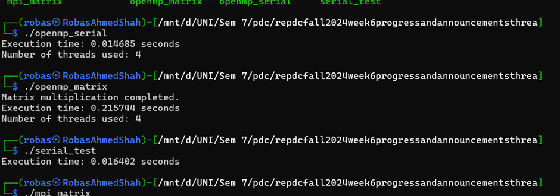
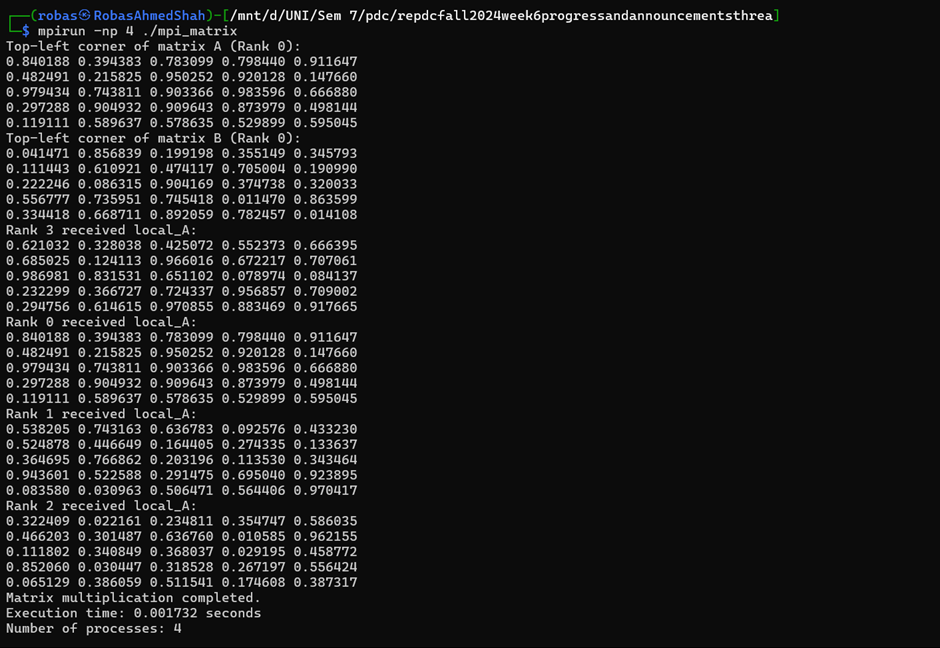

# OpenMP and MPI Matrix Multiplication

This README documents the commands, steps, and hardware characteristics for running OpenMP and MPI matrix multiplication programs.

## Task 1: Commands and Steps

### 1. Compile and Run OpenMP Serial Program

**Compilation Command:**
```
gcc -o openmp_serial openmp_serial.c -fopenmp
```

**Execution Command:**
```
./openmp_serial
```

**Description:** Compiles and executes the serial version of the OpenMP program.

**Output:**
```
Execution time: 0.014685 seconds
Number of threads used: 4
```

### 2. Compile and Run OpenMP Matrix Multiplication Program

**Compilation Command:**
```
gcc -o openmp_matrix openmp_matrix.c -fopenmp
```

**Execution Command:**
```
./openmp_matrix
```

**Description:** Compiles and executes the matrix multiplication using the OpenMP framework.

**Output:**
```
Matrix multiplication completed.
Execution time: 0.215744 seconds
Number of threads used: 4
```

### 3. Compile and Run Serial Test Program

**Compilation Command:**
```
gcc -o serial_test serial_test.c
```

**Execution Command:**
```
./serial_test
```

**Description:** Compiles and executes the serial test program.

**Output:**
```
Execution time: 0.016402 seconds
```

### 4. Compile and Run MPI Matrix Multiplication Program

**Compilation Command:**
```
mpicc -o mpi_matrix mpi_matrix.c
```

**Execution Command:**
```
mpirun -np 4 ./mpi_matrix
```

**Description:** Compiles and executes the MPI version of the matrix multiplication program using 4 processes.

**Output:**
```
Top-left corner of matrix A (Rank 0):
0.840188 0.394383 0.783099 0.798440 0.911647
0.482491 0.215825 0.950252 0.920128 0.147660
0.979434 0.743811 0.903366 0.983596 0.666880
0.297288 0.904932 0.909643 0.873979 0.498144
0.119111 0.589637 0.578635 0.529899 0.595045

Matrix multiplication completed.
Execution time: 0.001732 seconds
Number of processes: 4
```





## Task 2: Hardware Characteristics

### CPU Information
- **Model:** Intel(R) Core(TM) i7-8665U CPU @ 1.90GHz
- **Number of cores:** 4
- **Number of threads:** 8 (2 threads per core)
- **Clock speed:** 1.90 GHz

### Cache Information
- **L1d cache:** 128 KiB (4 instances)
- **L1i cache:** 128 KiB (4 instances)
- **L2 cache:** 1 MiB (4 instances)
- **L3 cache:** 8 MiB (1 instance)

### Memory Information
- **Total RAM:** 7834 MiB
- **Available RAM:** 7033 MiB

### Disk Information
- **Total disk space:** 1007 GiB (for /dev/sdc, your main filesystem)
- **Available disk space:** 943 GiB (for /dev/sdc, your main filesystem)

### Additional Observations
- **Load Average:** 0.05, 0.03, 0.00
- **Tasks:** 33 total (1 running, 32 sleeping)
- **Memory Usage:** 818.8 MiB used, 238.8 MiB buff/cache
- **Swap Usage:** 2048 MiB total, 2048 MiB free
- **CPU Utilization:** 0.0% user, 0.0% system, 0.0% nice, 100.0% idle


## Task 3: CPU-Z Report

For detailed CPU information, please refer to the CPU-Z report.


